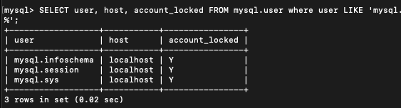
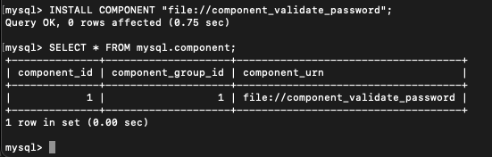
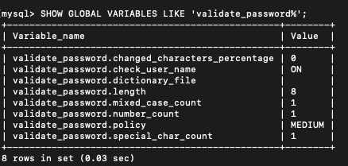

# 03 사용자 및 권한
MySQL의 사용자 계정은 단순히 사용자의 아이디뿐 아니라
해당 사용자가 **어느 IP에서** 접속하고 있는지도 확인한다.
MySQL 8.0부터는 권한을 묶어서 관리하는 역할의 개념이 도입됐기 때문에 꼭 알아두자

# 3.1 사용자 식별
MySQL의 사용자는 사용자의 접속 지점(실행된 호스트 명이나 도메인 또는 IP주소)도
계정 일부가 된다.
따라서 MySQL 에서 계정을 언급할 때는 다음과 같이 항상 아이디와 호스트를 함께 명시해야 한다.
역 따옴표(\`) 는 Mysql에서 식별자를 감싸는 따옴표 역할을 한다. 종종 홑따옴표(')도 사용한다.

다음의 계정은 항상 MySQL 서버가 기동 중인 로컬 호스트에서 svg_id라는 아이디로
접속할 때만 사용될 수 있는 계정이다. 다른 컴퓨터에서는 사용 불가능하다.
```
`svc_id`@`127.0.0.1`
```
만약 모든 외부 컴퓨터에 접속이 가능한 사용자 계정을 생성하고 싶다면
사용자 계정 호스트 부분을 %로 지정하면 된다.
% 문자는 모든 IP 또는 모든 호스트 명을 의미한다.

사용자 계정 식별에서 또 한 가지 주의할 점은 서로 동일한 아이디가 있을 때
MySQL 서버가 해당 사용자의 인증을 위해 어떤 계정을 선택하느냐다
```
`svc_id`@`192.168.0.10`(이 계정의 비밀번호는 123)
`svc_id`@`%`(이 계정의 비밀번호는 abc)
```
IP주소가 192.168.0.10일 경우 과연 어떤 계정 정보를 이용할까?
계정 정보에 따라 비밀번호가 다르기 때문에 경우에는 실패할 수 있다.

권한이나 계정 정보에 따라 MySQL은 범위가 가장 작은 것을 항상 먼저 선택한다.
위의 두 계정 정보 가운데 범위가 좁은 것은 %가 포함되지 않은 \`svc_id\`@\`192.168.0.10\`
이기 때문에 IP가 명시된 계정 정보를 이용해 인증하게 된다.

만약 해당 IP 주소에서 비밀번호를 abc를 입력하게 된다면 비밀번호가 일치하지 않는다는 이유로 접속이 거절될 것이다. 이런 실수에 유의하자

# 3.2 사용자 계정 관리
## 3.2.1 시스템 계정과 일반 계정

MySQL 8.0부터 계정은 SYSTEM_USER 권한을 가지고 있느냐에 따라서
시스템 계정과 일반 계정으로 구분된다.

시스템 계정은 데이터베이스 서버 관리자를 위한 계정이며, 일반 계정은 응용 프로그램이나
개발자를 위한 계정 정도로 생각하면 이해하기 쉬울 것이다.

시스템 계정은 시스템 계정과 일반 계정을 관리할 수 있지만
일반 계정은 시스템 계정을 관리할 수 없다.
다음과 같은 것들은 시스템 계정으로만 수행할 수 있다.

- 계정 관리(계정 생성 및 삭제, 그리고 계정의 권한 부여 및 제거)
- 다른 세션(Session) 또는 그 세션에서 실행 중인 쿼리를 강제 종료
- 스토어드 프로그램 생성 시

이렇게 계정을 분리한 것은 DBA 계정에는 SYSTEM_USER 권한을 할당하고
일반 사용자를 위한 계정에는 SYSTEM_USER 권한을 부여하지 않게 하기 위해서이다.

```
일반적으로 데이터베이스에는 계정과 사용자라는 말을 혼용하는데.
이번 장에서는 설명의 편의를 위해 `사용자`와 `계정`이라는 단어를 다음과 같이 구분하겠다.
- 사용자: MySQL 서버를 사용하는 주체
- 계정: MySQL 서버에 로그인하기 위한 식별자(로그인 아이디)
```

MySQL 서버에는 다음과 같이 내장된 계정들이 있는데, \`root\`@\`localhost\`를 제외한
3개의 계정은 내부적으로 각기 다른 목적으로 사용되므로 삭제하지 않도록 주의하자.
- 'mysql.sys'@'localhost': MySQL 8.0부터 기본적으로 내장된
  sys 스키마의 객체의 DEFINER로 사용되는 계정
- 'mysql.session'@'localhost': MySQL 플러그인이 서버로 접근할 때 사용되는 계정
- 'mysql.infoschema'@'localhost': information_schema에
  정의된 뷰의 DEFINER로 사용되는 계정

위에 언급한 3개의 계정은 처음부터 잠겨있는 상태이므로 의도적으로 잠금을 풀지 않는 한
악의적인 용도로 사용할 수 없으므로 보안을 걱정하지는 않아도 된다.



## 3.2.2 계정 생성
MySQL 8.0부터는 계정의 생성은 CREATE USER 명령으로, 권한 부여는 GRANT 명령으로
구분해서 실행하도록 바뀌었다. 계정을 생성할 때는 다음과 같은 다양한 옵션을 설정할 수 있다.
- 계정의 인식 방식과 비밀번호
- 비밀번호 관련 옵션(비밀번호 유효 기간, 비밀번호 이력 개수, 비밀번호 재사용 불가 기간)
- 기본 역할
- SSL 옵션
- 계정 잠금 여부
일반적으로 많이 사용되는 옵션을 가진 CREATE USER 명령은 다음과 같다.
```mysql
CREATE USER 'user'@'%'
	IDENTIFIED WITH 'mysql_native_password' BY 'password'
	REQUIRED NONE
	PASSWORD EXPIRE INTERVAL 30 DAY
	ACCOUNT UNLOCK
	PASSWORD HISTORY DEFAULT
	PASSWORD REUSE INTERVAL DEFAULT
	PASSWORD REQUIRED CURRENT DEFAULT;
```

위의 각 옵션을 하나씩 살펴보자

## IDENTIFIED WITH
사용자의 인증 방식과 비밀번호를 설정한다.
IDENTIFIED WITH 뒤에는 반드시 인증방식을 명시해야 하는데,
MySQL 서버의 기본 인증 방식을 사용하고자 한다면 IDENTIFIED WITH 'password' 형식으로 사용해야 한다.
다음 4가지 방법이 대표적이다
- Native Pluggable Authentication: MySQL 5.7버전까지 기본으로 사용되던 방식
  단순히 비밀번호에 대한 해시 값을 저장해두고 일치하는지 비교하는 방식

- Caching SHA-2 Pluggable Authentication:
  암호화 해시 값 생성을 위해 SHA-2 알고리즘을 사용한다.
  Native Pluggable Authentication 방식과의 가장 큰차이점은
  암호화 해시 알고리즘의 차이이며 기존 방식은 동일 해시 값을 출력하지만
  이 플러그인은 내부적으로 Salt키를 사용하여 동일한 키 값에 대해서도 결과가 달라진다.
  그래서 상당히 시간 소모적이어서 성능이 매우 떨어지는데 해시 결과 값을 메모리에 캐시 한다.
  그렇기때문에 이름에 캐시가 포함됨
  
- PAM Pluggable Authentication : 유닉스나 리눅스 패스워드 또는 LADP 같은 외부 인증을 사용할 수 있게 해주는 인증 방식, MySQL 엔터 프라이즈 에디션에서만 사용 가능함

- LADP Pluggable Authentication : LDAP을 이용한 외부 인증을 사용할 수 있게 해주는 인증 방식으로 MySQL 엔터프라이즈 에디션에서만 사용 가능하다.

MySQL 5.7 버전까지는 Native Authentication이 기본 인증 방식으로 사용됐지만
MySQL 8.0 버전부터는 Caching SHA-2 Authentication이 기본 인증으로 바뀌었다.
하지만 Cache SHA-2 Authentication은 SSL/TLS 또는 RSA 키페어를 필요로 하기 때문에
기존 MySQL 5.7까지의 연결 방식과는 다른 방식으로 접속해야 한다.

다음과 같은 방식으로 MySQL 8.0에서도 Native Authentication을 사용 가능하다.
```mysql
SET GLOBAL default_authentication_plugin="mysql_native_password"
```

## 3.2.2.2 REQUIRE
MySQL 서버에 접속할 때 암호화된 SSL/TLS 채널을 사용할지 여부를 설정한다.
만약 별도로 설정하지 않으면 비암호화 채널로 연결하게 된다.
하지만 REQUIRED 옵션을 SSL로 설정하지 않았다고 하더라도
Caching SHA-2 Authentication 인증 방식을 사용하면 암호화된 채널만으로
MySQL 서버에 접속할 수 있게 된다.
## 3.2.2.3 PASSWORD_EXPIRE
비밀번호의 유효 기간을 설정하는 옵션이다. 기본값은 default_password_lifetime 시스템 변수에 저장된 기간으로 유효 기간이 설정된다.
PASSWORD EXPIRE 절에 사용 가능한 옵션은 다음과 같다.
- PASSWORD EXPIRE : 계정 생성과 동시에 비밀번호의 만료 처리
- PASSWORD EXPIRE NEVER : 계정 비밀번호의 만료 기간 없음
- PASSWORD EXPIRE DEFAULT : default_password_lifetime 시스템 변수에 저장된 기간으로 비밀번호의 유효 기간을 설정
- PASSWORD EXPIRE INTERVAL : n DAY: 비밀번호의 유효 기간을 오늘부터 n일자로 설정

## 3.2.2.4 PASSWORD_HISTORY
한 번 사용했던 비밀번호를 재사용하지 못하게 설정하는 옵션인데, PASSWORD HISTORY 절에 설정 가능한 옵션은 다음과 같다.
- PASSWORD HISTORY DEFAULT : password_history 시스템 변수에 저장된 개수만큼 비밀번호의 이력을 저장하며, 저장된 이력에 남아있는 비밀번호는 재사용할 수 없다.
- PASSWORD HISTORY n : 최근 n개 까지만 저장하며, 저장된 이력에 남아있는 비밀번호는 재사용할 수 없다.

한 번 사용했던 비밀번호를 사용하지 못하게 하려면 이전에 사용했던 비밀번호를 MySQL 서버가 기억하고 있어야 하는데 이를 위해 MySQL 서버는 mysql DB의 password_history 테이블을 사용한다.

## 3.2.2.5 PASSWORD REUSE INTERVAL
한 번 사용했던 비밀번호의 재사용 금지 기간을 설정하는 옵션
기본값은 password_reuse_interval 시스템 변수에 저장된 기간이다.
다음과 같은 옵션을 설정할 수 있다.
- PASSWORD REUSE INTERVAL DEFAULT : 위의 변수에 저장된 기간으로 설정
- PASSWORD REUSE INTERVAL n DAY : n일차 이후에 비밀번호를 재사용할 수 있게 설정

## 3.2.2.6 PASSWORD REQUIRE
비밀번호가 만료되어 새로운 비밀번호로 변경할 때 현재 비밀번호를 필요로 할지 결정하는 옵션
기본값은 password_require_current 시스템 변수의 값으로 설정된다.
다음과 같은 옵션을 설정 가능하다.
- PASSWORD REQUIRE CURRENT: 현재 비밀번호를 먼저 입력하도록 설정
- PASSWORD REQUIRE OPTIONAL: 비밀번호를 변경할 때 현재 비밀번호를 입력하지 않아도 되는 설정
- PASSWORD REQUIRED DEFAULT : password_require_current 시스템 변수의 값으로 설정

## 3.2.2.7 ACCOUNT LOCK / UNLOCK
계정 생성 시 또는 ALTER USER 명령을 사용해 계정 정보를 변경할 때 계정을 사용하지 못하게 잠글지 여부를 결정
- ACCOUNT LOCK: 잠금
- ACCOUNT UNLICK : 잠긴 계정을 다시 사용 가능한 상태로 잠금 해제

# 3.3 비밀번호 관리
## 3.3.1 고수준 비밀번호
MySQL의 경우 비밀번호를 쉽게 유추할 수 있는 단어들이 사용되지 않게 글자의 조합을 강제하거나
금칙어를 설정하는 기능도 있다. MySQL 서버에서 비밀번호의 유효성 체크 규칙을 적용하려면
validate_password 컴포넌트를 이용하면 되는데, 우선 다음과 같이 validate_password 컴포넌트를 설치해야 한다.
validate_password 컴포넌트는 MySQL 서버 프로그램에 내장돼 있기 때문에 
INSTALL COMPONENT 명령의 file:// 부분에 별도의 파일 경로를 지정하지 않아도 된다. 




validate_password 컴포넌트가 설치되면 다음과 같이 컴포넌트에서 제공하는 시스템 변수를 확인 가능하다.




비밀번호 정책은 크게 다음 3가지 중에서 선택할 수 있으며, 기본값은 MEDIUM이다.
- LOW: 비밀번호의 길이만 검증
- MEDIUM : 비밀번호의 길이를 검증하며, 숫자와 대소문자, 특수문자의 배합을 검증
- STRONG: MEDIUM 레벨의 검증을 모두 수행하며, 금칙어가 포함되었는지 여부까지 검증

비밀번호의 길이는 validate_password.length 시스템 변수에 설정된 길이 이상의 비밀번호가 사용됐는지를 검증하며,  숫자와 대소문자, 특수문자는 validate_password.mixed_case_count
validate_password.number_count, validate_password.special_char_count 시스템 변수에 설정된 글자 수 이상을 포함하고 있는지 검증한다.

그리고 마지막으로 금칙어는 validate_password.dictionary_file 시스템 변수에 설정된 사전 파일에 명시된 단어를 포함하고 있는지를 검증한다.

기본적으로 querty나 1234와 같이 연속된 단어를 사용해도 아무런 에러 없이 설정된다.
만약에 이렇게 연속된 단어를 제한하고 싶다면 validate_password_dictionary_file 시스템 변수에 금칙어들이 저장된 사전 파일을 등록하면 된다.

금칙어 파일이 준비되면 다음과 같이 MySQL 서버에 금칙어 파일을 등록하면 된다.
비밀번호 금칙어는 validate_password.policy 시스템 변수가 'STRONG'으로 설정된 경우에만 작동하면 되므로 금칙어를 적용하려면 validate_password.policy 시스템 변수도 함께 설정하면 된다.

## 3.3.2 이중 비밀번호
많은 서버들이 응용 프로그램 서버들이 공용으로 데이터베이스 서버를 사용하기 때문에
데이터베이스 서버의 계정 정보는 쉽게 변경하기가 어려운데,
그중에서도 데이터베이스 계정의 비밀번호는 서비스가 실행 중인 상태에서 변경이 불가능했다.
그래서 서비스에서 데이터베이스 계정의 비밀번호는 처음 설정한 상태로 몇 년 동안 사용되는 경우가 많다.

계정의 데이터베이스 계정의 비밀번호는 보안을 위해 주기적으로 변경해야 하지만 지금까지는
서비스를 모두 멈추지 않고서는 비밀번호를 변경하는 것은 불가능한 일이었다.

이 같은 문제점을 해결하기 위해 MySQL 8.0 버전부터는 계정의 비밀번호를 2개의 값을 동시에
사용할 수 있는 기능을 추가했다. 
MySQL 서버 메뉴얼에서는 이 기능을 이중 비밀번호라고 소개한다.
```
여기서 '이중'은 영어의 Dual과는 조금 다른것으로 인증된다.
인증을 두 번 하는것이 아닌 두개의 비밀번호 모두 사용가능한 의미이다.
```

MySQL 서버의 이중 비밀번호 기능은 하나의 계정에 대해 2개의 비밀번호를 동시에 설정할 . 수있는데, 2개의 비밀번호는 프라이머리와 세컨더리로 구분된다.
최근에 설정된 비밀번호는 프라이머리 비밀번호이며, 이전 비밀번호는 세컨더리 비밀번호가 된다.
이중 비밀 비밀번호를 사용하려면 다음과 같이 기존 비밀번호 변경 구문에 RETAIN CURRENT PASSWORD 옵션만 추가하면 된다.

```mysql
// 비밀번호 변경
ALTER USER 'root'@'localhost' IDENTIFIED BY 'old_password';

// 비밀번호를 변경하면서 기존 비밀번호를 세컨더리 비밀번호로 변경
ALTER USER 'root'@'localhost' IDENTIFIED BY 'new_password' RETAIN CURRENT PASSWORD;

```
첫 번째 ALTER USER 명령이 실행되면 root 계정의 프라이머리 비밀번호는 'old_password'로 변경되고 세컨더리 비밀번호는 빈 상태가 된다.
두 번째 ALTER USER 명령이 실행되면 이전 비밀번호였던 'old_password'는 세컨더리 비밀번호로 변경되고, 새롭게 설정한 'new_password'는 프라이머리 비밀번호가 된다.

이 상태에서 두 비밀번호중 아무거나 입력해도 로그인이 된다.
이렇게 설정된 상태에서 데이터베이스에 연결하는 응용 프로그램의 소스코드나 설정 파일의 비밀번호를 새로운 비밀번호인 'new_password'로 변경하고 배포 및 재시작을 순차적으로 실행한다.

MySQL 서버에 접속하는 모든 응용 프로그램의 재시작이 완료되면 이제. 다음 명령으로 세컨더리 비밀번호는 삭제한다. 세컨더리 비밀번호를 꼭 삭제해야 하는 것은 아니지만 계정의 보안을 위해 세컨더리 비밀번호는 삭제하는 것이 좋다.

```mysql
ALTER USER 'root'@'localhost' DISCARD PASSWORD;
```
이렇게 세컨더리 비밀번호가 삭제되면 이제는 기존 비밀번호로는 로그인이 불가능하며,
새로운 비밀번호로만 로그인할 수 있게 된다.