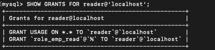
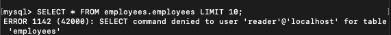
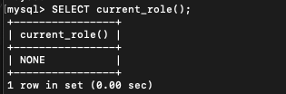
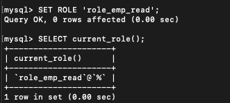
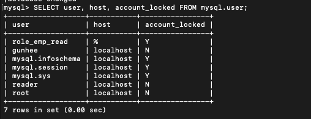

# 3.4 권한(Privilege)
MySQL 5.7 버전까지 권한은 글로벌 권한과 객체 단위의 권한으로 분리되었다.

데이터베이스나 테이블 이외의 객체에 적용되는 권한을 글로벌 권한이라고 하며
데이터베이스나 테이블을 제어하는 데 필요한 권한을 객체 권한이라 한다.

객체 권한은 GRANT 명령으로 권한을 부여할 때 반드시 특정 객체를 명시해야 하며
반대로 글로벌 권한은 GRANT 명령에서 특정 객체를 명시하지 말아야 한다.
예외적으로 ALL(또는 ALL PRIVILEGES)은 글로벌과 객체 권한 두 가지 용도로 사용될 수 있는데
특정 객체에 ALL 권한이 부여되면 해당 객체에 적용될 수 있는 모든 객체 권한을 부여하며
글로벌로 ALL이 사용되면 글로벌 수준에서 가능한 모든 권한을 부여하게 된다.

MySQL 8.0 버전부터는 MySQL 5.7 버전의 권한에 동적 권한이 추가됐다.
그리고 기존의 MySQL 5.7 버전부터 제공되던 권한을 정적 권한이라고 한다.

정적 권한은 MySQL의 소스코드에 고정적으로 명시돼 있는 권한을 의미하며
동적 권한은 MySQL 서버가 시작되면서 동적으로 생성되는 권한을 의미한다.

사용자에게 권한을 부여할 때는 GRANT 명령을 사용한다.
GRANT 명령은 다음과 같은 문법으로 작성하는데, 각 권한의 특성에 따라 GRANT 명령의 ON 절에 명시되는 오브젝트의 내용이 바뀌어야 한다.
```mysql
GRANT privilege_list ON db.table TO 'user'@'host';
```
MySQL 8.0 버전에서는 사용자를 먼저 생성하고 GRANT 명령으로 권한을 부여해야 한다.
privilege_list에는 구분자를 써서 앞의 표에 명시된 권한 여러 개를 동시에 명령할 수 있다.
TO 키워드 뒤에는 권한을 부여할 대상 사용자를 명시하고 ON 키워드 뒤에는
어떤 DB의 어떤 오브젝트에 권한을 부여할지 결정할 수 있는데 권한의 범위에 따라서 사용하는 방법이 달라진다.

글로벌 권한
```mysql
GRANT SUPER ON *.* TO 'user'@'localhost';
```
글로벌 권한은 특정 DB나 테이블에 부여될 수 없기 때문에 글로벌 권한을 부여할 때 
GRANT 명령어의 ON 절에는 항상 \*.\*를 사용하게 된다. \*.\*은 모든 DB의 모든 오브젝트를
포함해서 MySQL 서버 전체를 의미한다.

DB 권한
```mysql
GRANT EVENT ON *.* TO 'user'@'localhost';
GRANT EVENT ON employees. * TO 'user'@'localhost';
```
DB 권한은 특정 DB에 대해서만 권한을 부여하거나 서버에 존재하는 모든 DB에 대해 권한을 부여할 수 있기 때문에 위의 예제와 같이 사용할 . 수있다.
여기서 DB라 함은 DB 내부에 존재하는 테이블뿐만 아니라 스토어드 프로그램들도 모두 포함된다.

하지만 DB 권한만 부여하는 경우 테이블까지 명시할 수 없습니다.

테이블 권한
```mysql
GRANT SELECT, INSERT, UPDATE, DELETE ON *.* TO 'user'@'localhost';
GRANT SELECT, INSERT, UPDATE, DELETE ON employees.* TO 'user'@'localhost';

GRANT SELECT, INSERT, UPDATE, DELETE ON employees.department TO
'user'@'localhost';
```
모든 DB, 특정 DB, 특정 테이블 모두 가능하다.

특정 칼럼에 대해서만 권한을 부여하는것도 가능하며 문법이 조금 달라진다.
DELETE를 제외한 INSERT, UPDATE, SELECT 3가지가 가능하다.
특정 칼럼을 넣어주면 된다. 아래의 경우 UPDATE만 가능하다.
```mysql
GRANT SELECT, INSERT, UPDATE(dept_name) ON employees.department TO 'user'@'localhost';
```
칼럼 단위의 접근 권한이 필요하면 별도의 뷰를 만들어 사용하는 방법도 생각해볼 수 있다.
뷰도 하나의 테이블로 인식되기 때문에 뷰를 만들어 두면 뷰의 칼럼에 대한 권한을 체크하지 않고
뷰 자체에 대한 권한만 체크하게 된다.

각 계정의 권한이나 역할을 확인하기 위해서는 SHOW GRANT 명령을 사용할 수도 있지만
표 형태로 깔끔하게 보고자 한다면 mysql DB의 권한 관련 테이블을 참조하면 된다.

# 3.5 역할(Role)
MySQL 8.0 버전부터 권한을 묶어서 역할을 사용할 수 있게 됐다.
실제 MySQL 서버 내부적으로 역할은 계정과 똑같은 모습을 하고 있다.
간단히 MySQL 8.0에서 역할을 사용하는 예시를 살펴보자

우선 CREATE ROLE 명령을 이용해 role_emp_read와 role_emp_write라는 이름의 역할을 정의한다.
```mysql
CREATE ROLE
	role_emp_read,
	role_emp_write;
```
위의 CREATE ROLE 명령에서는 빈 껍데기만 있는 역할을 정의한 것이며
실질적인 권한을 부여하면 된다.
```mysql
GRANT SELECT ON employees.* TO role_emp_read;
GRANT INSERT, UPDATE, DELETE ON employees.* TO role_emp_write;
```
기본적으로 역할은 그자체로 사용될 수 없고 계정에 부여해야 한다.
```mysql
CREATE USER reader@'127.0.0.1' IDENTIFIED BY 'querty';
GRANT role_emp_read TO reader@'127.0.0.1';

CREATE USER writer@'127.0.0.1' IDENTIFIED BY 'querty'
GRANT role_emp_write TO writer@'127.0.0.1';
```





이 때 실제로 역할은 부여되어 있지만 계정의 활성화된 역할을 조회해보면 role_emp_read 역할이 없다






reader 계정이 role_emp_read 역할을 사용할 수 있게 하려면
다음과 같이 SET ROLE 명령을 실행해 해당 역할을 활성화해야 한다.




역할이 활성화 되면 그 역할이 가진 권한은 사용할 수 있는 상태가 되지만 
계정이 로그아웃됐다가 다시 로그인하면 역할이 활성화되지 않은 상태로 초기화돼 버린다.

activity_all_roles_on_login 변수로 로그인 할 때 마다 자동으로 활성화할 수 있다.
```mysql
SET GLOBAL activate_all_roles_on_login=ON;
```

앞에서도 잠깐 언급했듯이 MySQL 서버의 역할은 사용자 계정과 거의 같은 모습을 하고 있으며,
MySQL 서버 내부적으로 역할과 계정은 동일한 객체로 취급된다.
단지 하나의 사용자 계정에 다른 사용자 테이블이 가진 권한을 병합해서 
권한 제어가 가능해졌을 뿐이다.





하나의 계정에 다른 계정의 권한을 병합하기만 하면 되므로 MySQL 서버는 역할과 계정을 구분할 필요가 없다.

역할과 계정은 내외부적으로 동일한 객체라고 했는데
왜 MySQL 서버에서는 굳이 CREATE ROLE 명령어와 
CREATE USER 명령을 구분해서 지원할까?
이는 데이터베이스 관리의 직무를 분리할 수 있게 해서. 
보안을 강화하는 용도로 사용될 수 있게 하기 위해서다.